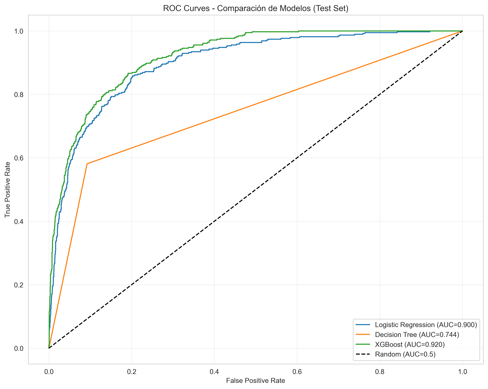

# Prediccion de Intencion de Compra en E-commerce

Proyecto de ciencia de datos para predecir si una sesion de navegacion finaliza en compra (`Revenue = 1`) o no (`Revenue = 0`) a partir de variables de comportamiento web.

## Descripcion breve del problema y objetivo

En e-commerce, no siempre se puede identificar en tiempo real que sesiones tienen alta probabilidad de conversion. Esto dificulta activar acciones comerciales oportunas (ofertas, retargeting, mensajes personalizados).

El objetivo del proyecto es entrenar y seleccionar un modelo de clasificacion binaria que estime la probabilidad de compra por sesion para apoyar decisiones de negocio proactivas.

## Resumen del EDA

Hallazgos principales obtenidos en `notebooks/exploratory/eda.ipynb`:

- Dataset con 18 atributos (10 numericos y 8 categoricos), sin valores faltantes y con registros duplicados detectados.
- Variable objetivo desbalanceada: ~85% No Compra y ~15% Compra.
- Variables numericas con sesgo positivo fuerte y outliers, especialmente en duraciones y `PageValues`.
- `PageValues` aparece como predictor clave de conversion.
- `BounceRates` y `ExitRates` se asocian negativamente con compra y muestran alta correlacion entre si.
- Se observa estacionalidad: noviembre presenta el mayor nivel de conversion.
- Resultado interesante: `New_Visitor` convierte mas que `Returning_Visitor` en este dataset.

## Resumen del modelado

El modelado se desarrollo en `notebooks/modeling/modelado.ipynb` comparando Logistic Regression, Decision Tree y XGBoost.

Configuracion general:

- Split train/test 80/20 estratificado.
- Validacion cruzada `StratifiedKFold` de 5 folds.
- Preprocesamiento con `ColumnTransformer`:
    - `StandardScaler` para variables numericas.
    - `OneHotEncoder` para categoricas.

Modelo ganador: XGBoost

Metricas en test set:

- Accuracy: 0.8820
- Precision: 0.6022
- Recall: 0.7251
- F1-Score: 0.6580
- ROC-AUC: 0.9205

Comparacion ROC/AUC de modelos (test set):



Comparativa AUC:

| Modelo | ROC-AUC |
|---|---:|
| XGBoost | 0.9205 |
| Logistic Regression | 0.8997 |
| Decision Tree | 0.7444 |

## Como ejecutar la demo

La demo esta implementada con Streamlit en `apps/streamlit_app.py`.

1. Crear y activar entorno virtual:

```powershell
python -m venv .venv
.\.venv\Scripts\Activate.ps1
```

2. Instalar dependencias:

```powershell
python -m pip install -r requirements.txt
```

3. Ejecutar la app:

```powershell
streamlit run apps/streamlit_app.py
```

Notas:

- Asegurate de tener `models/modelo_ganador.pkl` (y opcionalmente `models/preprocessor.pkl`) en la carpeta `models/`.
- El modelo y los artefactos generados en el entrenamiento se guardan en `models/`.

## Estructura de carpetas

```text
intencion_compra_0/
|-- apps/
|   |-- README.md
|   |-- streamlit_app.py
|   `-- utils.py
|-- data/
|   |-- processed/
|   `-- raw/
|-- docs/
|-- models/
`-- notebooks/
        |-- exploratory/
        `-- modeling/
```
